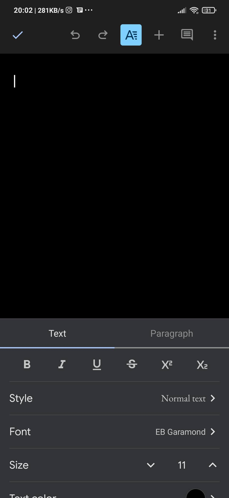
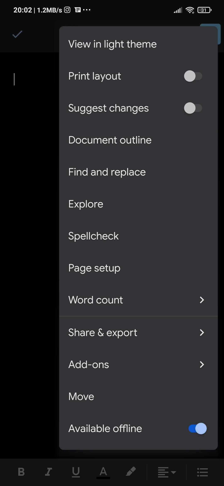

In Google Docs, the top row toggles Controls.

Here, the binary Handle "Style" is turned on. The property sheet for the current cursor or selection is visible and shows the active properties. In fact, two property sheets are open because the cursor represents two nodes in the Scene tree: the current selection range as well as the current paragraph. If the cursor is in a table cell and you select the table cell, a third property sheet springs up (see next picture). The mobile interface collapses them into tabs to conserve space and focus. If you want to build this Ui around your datatype (a tree-shaped rich document in this case) and define the Ui at the nodes where the data is. In Elm, you can employ the nested modules pattern, where each module represents a type, and types can be nested to a certain extent. Then, each module has one `view` function that would output a Scene as well as a Control. The Main `view` can `wrap` all Controls into a tabbed interface. This way, your Ui definitions are close to your data, and you don't need to handle the proliferation and mapping of nested View-related messages.

